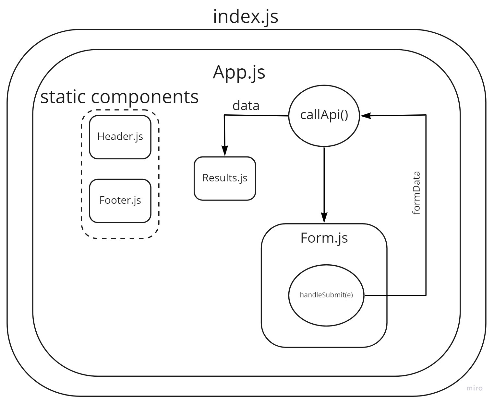
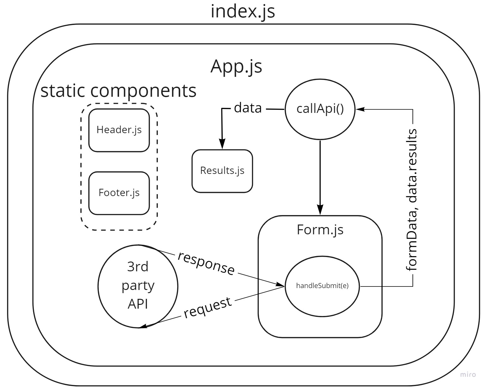

# RESTy

### Author : Rami Zregat

## Lab 26

### Links:

- [Pull Request](https://github.com/RamiZregat/resty/pull/1)
- [SandBox](https://codesandbox.io/s/heuristic-golick-j5lc2?file=/src/components/footer/index.js)

### Setup

#### Running the app

- `npm start`

### UML:

## Lab 27

### Links:

- [Pull Request](https://github.com/RamiZregat/resty/pull/3)
- [SandBox](https://codesandbox.io/s/zen-field-ws8l6)

### Setup

#### Running the app

- `npm start`

### UML:

## Lab 28

### Links:

- [Pull Request](https://github.com/RamiZregat/resty/pull/7)
- [Deployed link](https://ramizregat-resty.netlify.app)

### Setup

#### Running the app

- `npm start`

### UML:

